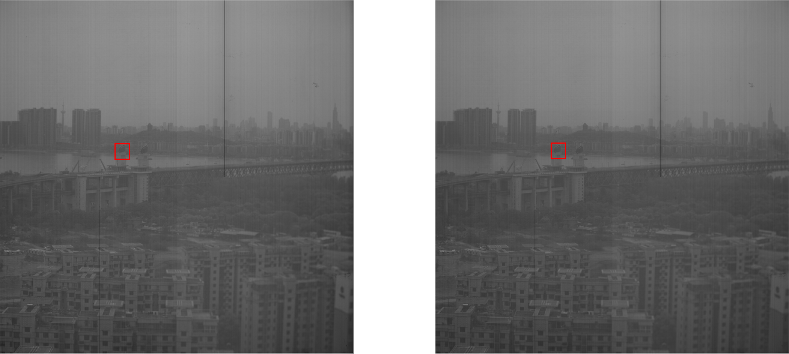

# VPS项目相关代码（特大图像降噪部分）

***
## 内容简介

此代码库集成了三种基于深度卷积网络的图像降噪方法，并针对特大分辨率图像设计了分块处理的机制。

包含的深度降噪网络如下：

1. CBDNet 【CVPR 2019】

   参考文献：[Toward Convolutional Blind Denoising of Real Photographs](https://arxiv.org/pdf/1807.04686v2.pdf)

   预训练模型可从[这里](https://drive.google.com/drive/folders/1-e2nPCr_eP1cTDhFFes27Rjj-QXzMk5u)获取。

2. DnCNN 【IEEE 2017】

   参考文献：[Beyond a Gaussian Denoiser: Residual Learning of Deep CNN for Image Denoising](https://arxiv.org/pdf/1608.03981v1.pdf)

   预训练模型可从[这里](https://github.com/cjy97/DnCNN-PyTorch)获取。

3. RIDNet 【ICCV 2019】

   参考文献：[Real Image Denoising with Feature Attention](https://arxiv.org/pdf/1904.07396v2.pdf)

   预训练模型可从[这里](https://drive.google.com/file/d/1QxO6KFOVxaYYiwxliwngxhw_xCtInSHd/view)获取。

***
## 代码结构

代码库中保留大量此前尝试过的内容，其中部分已经弃用，不再列出。

    VPS/
        noise_imgs/         待处理噪音图像默认存放路径
        src_imgs/           无噪音原图默认存放路径
        denoise_imgs/       处理后去噪图像默认输出路径
        save_models/        去噪网络预训练权重文件存放路径
        model/              去噪网络定义代码
        utils/              常用图像操作
        data/               数据加载（重训练模型时用到）
        ... ...
        predict.py          主要去噪调用入口，详见下一节“使用方法”
        denoise.py          部分基于滤波算子的常规去噪方法
        SN.py               PSNR指标的计算
        train_cbdnet.py     重训练CBDNet
        train_dncnn.py      重训练DnCNN

***
## 使用方法

与特大分辨率图像降噪相关的代码，主要位于./predict.py文件下的crop_denoise_1G_img()函数中。

事先需将待处理的噪音图像存放到denoise_dir对应目录下，将选用的降噪网络预训练文件存放到save_dir对应目录下。

$ 通过运行如下指令，执行图像降噪：

    python predict.py \
      --noise_dir noise_imgs \
      --src_dir src_imgs \
      --denoise_dir denoise_img \
      --save_dir save_models \
      --patch_size 2000 \
      --model_type CBDNet

超参数简介：

- `noise_dir`: 待处理的噪音图像存放目录。默认为"noise_imgs/"。
- `src_dir`: 无噪音的原图存放目录。作为Groud Truth供计算降噪前后的PSNR指标。（若无原图，则默认为空。）
- `denoise_dir`: 降噪后的图像输出目录。默认为"denoise_img/"。
- `save_dir`: 深度降噪网络预训练模型路径。默认为"save_models/"。
- `patch_size`: 表示图像分块的尺寸，根据设备显存动态调整。
- `model_type`: 使用的深度降噪网络类型，从上述三种模型中选取。

针对特大分辨率图像造成的显存开销过高问题，crop_denoise_1G_img()函数中将完整图像按照指定的patch_size进行分块，逐块通过深度降噪网络，所得输出再重新拼合。

为减轻显存压力，图像的分块和重新拼合都在Numpy数组的层次进行。任意时刻进程只持有单个patch所对应的Torch张量。

使用者可通过smi指令查看服务器上的显存占用情况，从而灵活设置patch_size参数的大小。

***
## 运行效果

实验结果显示，深度降噪网络能够显著消除图像中的微观噪点，同时基本不影响图像的整体视觉效果。

同时，分块处理方法并不会在处理后的图像上遗留明显的边界痕迹。

**(去噪前后-整体效果)**

**(去噪前后-局部（上图中红框区域）效果)**

处理后的图像转换成jpg格式，文件大小显著压缩（因为细节噪点的减少，jpg格式能够以更小的成本进行文件编码）。

**(去噪前后-jpg格式文件大小（采用RIDNET测试）)**
| 图像格式       |处理前 |处理后   |
|:--:             |:--:     |:--:      |
|bmp格式（无压缩）|  976M  |  976M  |
|jpg格式（有压缩）|  444M  |  123M  |
